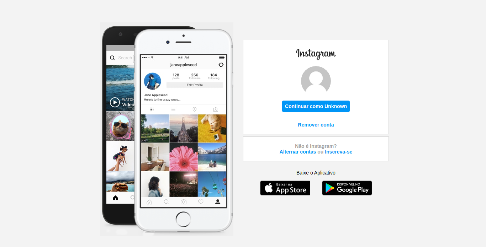

## Página Inicial do Instagram :camera:

	
	Resultado final do projeto.

## Sobre o projeto
Projeto desenvolvido no Bootcamp **Decola Dev Avanade 2021** da Digital Innovation One. O principal objetivo ao desenvolver esse projeto, era praticar o desenvolvimento Front-end, isto é, HTML e CSS. A ideia era criar uma página inicial parecida com a do Instagram. Em nenhum momento o objetivo foi fazer um **_clone_** do Instagram. Por fim, a página inicial aqui, **não** consiste na página de "primeiro login" do usuário, mas sim de um usuário que já fez login anteriormente.

## Considerações
Creio que foi um bom projeto tanto para programadores iniciantes quanto para os mais experientes. Pois mesmo que não se aprenda nada novo, sempre é possível aprender novas maneiras de fazer coisas que já fazíamos, as vezes até melhor. 